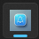

# タスクバーアイコン点滅検知アプリ

```Note
この文書の英語版は ChatGPT により生成されました。
AI 生成翻訳のため、元の日本語のニュアンスと異なる場合があります。
ご了承ください。
```

このアプリケーションは、タスクバー上の他のアプリケーションのアイコンを監視し、点滅などのビジュアル変化を検知した際に Discord Bot 経由で通知を送るツールです。バックエンドは Rust、フロントエンドは React を利用した Tauri フレームワークで開発されています。

---

## 背景

タスクバーアイコンは、アプリ側が通知を行う際のビジュアルメッセージとして機能します。例えば、新着メッセージや未読通知、ゲームのマッチングがある場合に点滅することでユーザーに知らせます。しかし、バックグラウンドで動作している場合などに通知を見逃す可能性があります。  
このアプリは、画面を常に確認できないユーザー向けに、「点滅前」から「点滅後」へのアイコン変化を検知し、ユーザーへ通知を行います。

### アイコンのイメージ変化

以下にアプリケーションのアイコンがどのように変化するかを示します。

- **通常状態 (点滅前):**  
    通常時のアイコン表示  
    

- **点滅状態 (点滅後):**  
    通知が必要な事象発生時の点滅表示  
    

---

## 特徴

-   **タスクバーアイコン監視:** 指定したアプリケーションのアイコンをリアルタイムで監視します。
-   **点滅検知:** アイコンのビジュアル変化を検知し、点滅状態を判断します。
-   **Discord 通知:** 検知した変化を Discord Bot を通じて即時に通知します。
-   **直感的な UI:** 2 つのリストビューと「監視」や「停止」ボタンで簡単に操作可能です。
-   **軽量設計:** Rust と React による効率的な実装で、システムリソースへの負荷を最小限に抑えます。

---

## 動作環境

-   **対応 OS:** Windows 10 以降
-   **開発言語:**
    -   バックエンド: Rust（最新の Stable バージョン推奨）
    -   フロントエンド: React
-   **フレームワーク:** Tauri
-   **必要権限:** ユーザー権限（管理者権限不要）

---

## インストール手順

1. **リポジトリのクローン:**

    ```
    git clone https://github.com/TKAilf/flash-code.git
    ```

2. **ディレクトリの移動:**

    ```
    cd flash-code
    ```

3. **依存関係のインストール:**

    - **バックエンド:**
        ```
        cd src-tauri
        cargo install
        ```
    - **フロントエンド:**
        ```
        cd ../
        npm install
        ```

4. **アプリケーションのビルドと実行:**

    ```
    npm run tauri dev
    ```

5. **Discord Bot 設定:**  
    サービス内の Discord Bot 用テキストエリアに Webhook URL を入力し、設定ボタンを押下してください。

---

## 使い方

1. **アプリ起動:**  
    上記のコマンドで起動します。

2. **監視対象の設定:**  
    左側のリストビューに現在のタスクバーアプリが表示されます。監視したいアプリを選び、右側のリストビューに移動します。

3. **Discord Bot 設定:**  
    Discord Bot の Webhook URL を入力後、設定ボタンを押してください。

4. **監視の開始:**  
    「全てを監視」または「監視」ボタンで、右リストのアプリの監視が開始されます。

5. **通知確認:**  
    アイコンの変化が検知されると、設定した Discord チャンネルへメッセージが送信されます。

6. **監視の停止と終了:**  
    「監視停止」または「閉じる」ボタンで、すべての監視が停止されます。

---

## 設定項目

-   **監視間隔の調整:**  
     「監視時間」の数値を変更することで、画像キャプチャの間隔（ミリ秒単位）を調整できます。

-   **しきい値の設定:**  
     「画像のしきい値」の変更により、検知精度を調整可能です。

---

## 注意事項

-   **プライバシー:**  
     本アプリはタスクバーアイコンのビジュアル変化のみを監視し、個人情報は収集・送信しません。

-   **システム負荷:**  
     定期的な画像キャプチャと比較により、CPU 使用率が上昇する可能性があります。高負荷の場合は監視間隔(monitor_interval)を増やしてください。

-   **セキュリティソフトの競合:**  
     一部のセキュリティソフトがこのアプリの動作を制限する場合、除外リストに追加してください。

---

## ライセンス

MIT ライセンスの下で提供されています。詳細は [LICENSE](./LICENSE) ファイルをご覧ください。

---

## 貢献

バグ報告や機能提案は Issue Tracker へ。プルリクエストも歓迎します。

---

## 開発者向け情報

### 必要な環境

-   **バックエンド:**

    -   Rust（最新の Stable バージョン）
    -   Cargo

-   **フロントエンド:**

    -   Node.js 20 以上
    -   npm または yarn

-   **その他:**
    -   Tauri CLI
        ```
        cargo install tauri-cli
        ```

### ビルド手順

1. **リポジトリのクローン:**

    ```
    git clone https://github.com/TKAilf/flash-code.git
    ```

2. **依存関係のインストール:**

    ```
    cd flash-code
    npm install
    cd src-tauri
    cargo build
    ```

3. **アプリケーションのビルド:**

    ```
    npm run tauri build
    ```

4. **実行ファイルの確認:**  
    ビルド後、`src-tauri/target/release` に実行ファイルが生成されます。

---

## 連絡先

質問・お問い合わせは以下のメールアドレスまで:

-   **Email:** ktoshiki0511@yahoo.co.jp

---

**最終更新日:** 2025 年 01 月 24 日

---

# Taskbar Icon Flash Detector (Translated using ChatGPT)

This section provides the English version of the document.

---

## Overview

This application monitors the icons of other applications displayed on the taskbar and sends notifications via a Discord Bot when visual changes, such as flashing, are detected. It is developed using the Tauri framework with Rust as its backend and React as its frontend.

---

## Features

-   **Taskbar Icon Monitoring:**  
     Real-time monitoring of specified taskbar application icons.

-   **Flash Detection:**  
     Identifies changes in the icons to determine if they are flashing.

-   **Discord Notifications:**  
     Sends immediate alerts via a Discord Bot when changes are detected.

-   **Intuitive UI:**  
     Simple operation with two list views and buttons like "Monitor" and "Stop".

-   **Lightweight Design:**  
     Efficiently built using Rust and React to minimize system resource usage.

---

## System Requirements

-   **Supported OS:** Windows 10 or later
-   **Languages:**
    -   Backend: Rust (latest stable version recommended)
    -   Frontend: React
-   **Framework:** Tauri
-   **Permissions:** User privileges (administrator rights not required)

---

## Installation

1. **Clone the Repository:**

    ```
    git clone https://github.com/TKAilf/flash-code.git
    ```

2. **Navigate to the Project Directory:**

    ```
    cd flash-code
    ```

3. **Install Dependencies:**

    - **Backend:**
        ```
        cd src-tauri
        cargo install
        ```
    - **Frontend:**
        ```
        cd ../
        npm install
        ```

4. **Build and Run the Application:**

    ```
    npm run tauri dev
    ```

5. **Configure the Discord Bot:**  
    Enter your Webhook URL in the designated text area within the service, then click the settings button.

---

## Usage

1. **Start the Application:**  
    Launch it using the command above.

2. **Set Monitoring Targets:**  
    The left list view displays currently active taskbar applications. Select the applications you wish to monitor and move them to the right list view.

3. **Configure the Discord Bot:**  
    Input the Discord Bot Webhook URL and click the settings button.

4. **Begin Monitoring:**  
    Click “Monitor All” or “Monitor” to start monitoring the selected applications.

5. **Check Notifications:**  
    When a change is detected in the taskbar icon, a message is sent to the configured Discord channel.

6. **Stop Monitoring:**  
    Use the “Stop Monitoring” or “Close” button to halt all monitoring.

---

## Settings

-   **Adjust Monitoring Interval:**  
     Change the value in the "Monitoring Time" field (in milliseconds) to adjust the capture frequency.

-   **Threshold Settings:**  
     Modify the "Image Threshold" to alter detection accuracy.

---

## Notes

-   **Privacy Considerations:**  
     The application only monitors visual changes; no personal information is collected or transmitted.

-   **System Load:**  
     Periodic image capturing and comparison might increase CPU usage. Increase the monitor_interval value if needed.

-   **Security Software Conflicts:**  
     If the application is restricted by security software, add it to your exclusion list.

---

## License

This application is licensed under the MIT License. See the [LICENSE](./LICENSE) file for details.

---

## Contributing

Bug reports, feature suggestions, and pull requests are welcome via the Issue Tracker.

---

## Developer Information

### Required Environment

-   **Backend:**

    -   Rust (latest stable version)
    -   Cargo

-   **Frontend:**

    -   Node.js 20 or later
    -   npm or yarn

-   **Other:**
    -   Tauri CLI
        ```
        cargo install tauri-cli
        ```

### Build Procedure

1. **Clone the Repository:**

    ```
    git clone https://github.com/TKAilf/flash-code.git
    ```

2. **Install Dependencies:**

    ```
    cd flash-code
    npm install
    cd src-tauri
    cargo build
    ```

3. **Build the Application:**

    ```
    npm run tauri build
    ```

4. **Check the Executable:**  
    Upon a successful build, the executable will be located in `src-tauri/target/release`.

---

## Contact

For any questions or inquiries, please contact:

-   **Email:** ktoshiki0511@yahoo.co.jp

---

**Last Updated:** January 24, 2025
